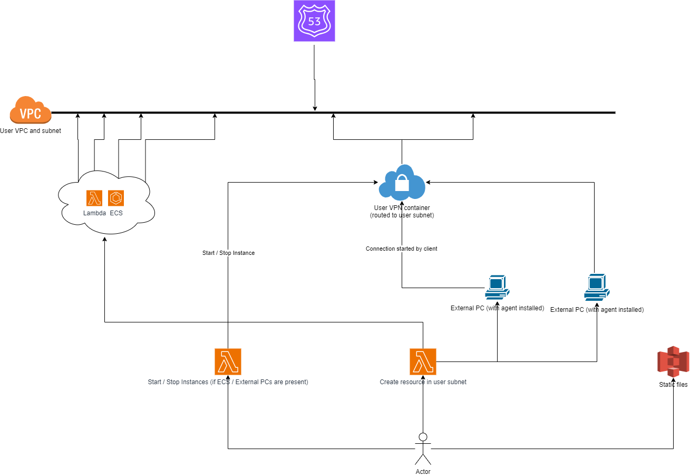

# WOMM (It Works On My Machine)

## 1. Introduction
**WOMM** intends to provide a visual representation of different computing resources as they are connected to your network, with the final results being an easier overview over the entire system, as well as the flexibility to add and remove resources from managed entities as you please.

Although this project is aimed more for small projects and hobbyists, it can also be used to represent large scale systems.

## 2. Architecture
In the *diagrams* folder, you can see the different implementations that have been taken into consideration during the development of this package.
As of this moment, the current implemenetation presented here is *womm.drawio*, as depicted in the following picture:

## 3. TODO list
### 3.1. Backbone
- [ ] Create network manager to support 1 subnet / user scenario
    - [ ] AWS
    - [ ] Azure
    - [ ] Linux
    - [ ] Windows
- [ ] Create resource manager, one for each backbone type (labels will be used to track ownership of resources)
    - [ ] AWS (ECS, Lambda)
    - [ ] Azure (Azure Container Instances, Functions)
    - [ ] Linux (Docker, Containerd)
    - [ ] Windows (Docker)
- [ ] Implement VPN solution as a container (probably Wireguard?)
- [ ] Implement logic to start / stop VPN container
- [ ] Implement logic to start / stop / create / delete resources

### 3.2. Website (GUI)
- [ ] Create S3 bucket to host static page
I may list the elements as a simple flexbox with divs right now, as I can trace all the lines and draw the fancy stuff later.

### 3.3 Agents
- [ ] Implement VPN client technology (probably Wireguard?)
- [ ] Implement health checks (may be built-in)
- [ ] Implement ACL with specific ports that are allowed
